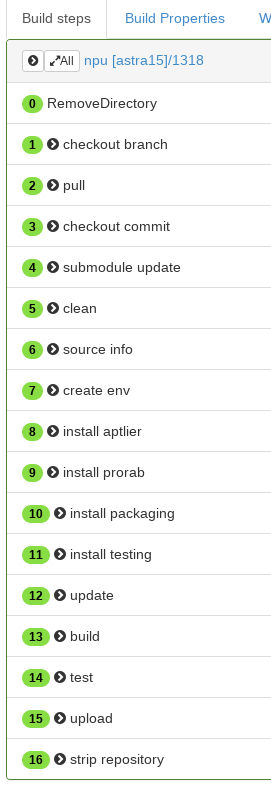

# CI/CD

---

# CI/cd

---

# CI

---

# CI в КТБС

* Что было?

---

# CI в КТБС

* Что было?
* Что сейчас?

---

# CI в КТБС

* Что было?
* Что сейчас?
* Зачем то, что сейчас?! Я просто хочу программировать!

---

# CI в КТБС

* Что было?
* Что сейчас?
* Зачем то, что сейчас?! Я просто хочу программировать!
* Планы на будущее

---

# CI в КТБС (декабрь 2016)

* CI: buildbot (python 2.7)
* Targets: astra 1.5, windows(?)
* Internal tools: packaging, cprorab (c++/cmake)
* External tools: fpm, docker
* Storage: reprepro

---

# CI в КТБС (декабрь 2018)

* CI: buildbot (python 3)
* Targets: astra 1.5, ubuntu 16.04, docker, windows
* Internal tools: packaging, cprorab (c++/cmake), aptlier (cli для работы с aptly),
    orion-buildbot, package-description, testing
* External tools: fpm, docker
* Storage: aptly, docker registry, windows smb server

---

# debian репозитории это просто!

---

# CI в КТБС (февраль 2019)

* CI: buildbot (python 3), **gitlab-ci**
* Targets: astra 1.5, ubuntu 16.04, docker, windows
* Internal tools: packaging, cprorab (c++/cmake), aptlier (cli для работы с aptly),
    orion-buildbot, package-description, testing
* External tools: fpm, docker
* Storage: aptly, docker registry, windows smb server, **gitlab-pages**

---

# Buildbot

## Pros:
* python
* гибкий
## Cons:
* не интегрирован в системы контроля версий
* нельзя исполнять команды в docker контейнере и использовать docker сервисы (из коробки)
* императивный
* много багов в страшном веб-интерфейсе
* медленно разрабатывается
* туманная документация

---

# Зачем нам gitlab-ci?

---

# Потому что у нас gitlab

---

# Gitlab-CI

## Pros:
* интегрирован в gitlab
* декларативный
* отличная документация
* можно исполнять команды в docker контейнере и использовать docker сервисы
* активно разрабатывается
## Cons:
* не такой гибкий

---

# Gitlab-CI

## Pros:
* интегрирован в gitlab
    * **pipeline начинается сразу после коммита**
    * **можно запретить merge в случае фейла**
* декларативный
* отличная документация
* можно исполнять команды в docker контейнере и использовать docker сервисы
* активно разрабатывается
## Cons:
* не такой гибкий

---

# Buildbot pipeline

---

# Gitlab-CI pipeline

---

# Планы

* Перевести всё что можно на gitlab-ci
* Максимально отказаться от централизированных хранилищ описания сборки (package-description)
* Всегда использовать паттерн (gitflow-like):
    * new branch
    * commit «add feature X»
    * pipeline failed
    * wip
    * pipeline succeed
    * squash commit
    * remove branch

---

# Вопросы
